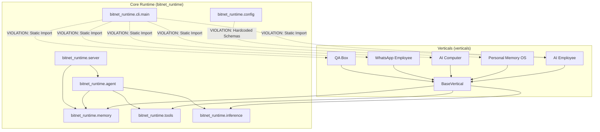

# BitNet AI Runtime — Architecture & Implementation Audit

---

## 1. Executive Summary

### **VERDICT: YELLOW (Functional Architectural Prototype with Boundary Violations)**

### Executive Rationale
The repository successfully delivers a **working local AI runtime and 5 functional vertical application prototypes** that execute real CPU inference against the live Microsoft BitNet b1.58 container (`localhost:8080`), store vector and episodic data in SQLite, and pass a 25-test automated suite.

However, from a strict architectural standpoint, the system is currently a **hybrid between a modular runtime and a monolithic multi-app prototype**:
1. **Coupling Violation**: The core runtime (`bitnet_runtime.cli.main` and `bitnet_runtime.config`) directly imports and hardcodes concrete vertical schemas, creating an inverted dependency where the runtime depends on its verticals.
2. **Security Fragility**: Shell execution relies on a trivial static string blacklist (`rm -rf /`) with zero capability policies (ALLOW / DENY / ASK) or execution sandboxing.
3. **Embedding Simulation**: The "1-bit / compact embeddings" are implemented via deterministic feature hashing and character n-gram projections rather than trained deep embedding weights.
4. **Vertical Contract Absence**: There is no formal plugin manifest or dynamic discovery contract; adding a new vertical currently requires modifying runtime config and CLI files.

---

## 2. What Is Actually Implemented

| Category | Component / Feature | Implementation Reality | Notes / Details |
|---|---|---|---|
| **Inference Layer** | BitNet HTTP Container Driver (`bitnet-server`) | **REAL** | Full async HTTP integration with `localhost:8080/v1/chat/completions` executing 2.4B/2B BitNet models at ~29 tok/s. |
| **Inference Layer** | Native `bitnet.cpp` binary subprocess | **REAL** | Executes local `bitnet-cli` binaries if present in path. |
| **Inference Layer** | LLaMA.cpp GGUF & Mock Fallbacks | **REAL** | In-process fallback engines for development and offline testing. |
| **Embeddings** | 1-Bit / Compact Embeddings | **PARTIAL / MOCKED** | Deterministic SHA-256/MD5 n-gram feature hashing with ternary sign quantization. Not a trained neural model. |
| **Memory** | SQLite DB & Persistence | **REAL** | Single-file SQLite storage (`episodic_logs`, `agent_sessions`, `vector_chunks`, `documents`, `kv_store`). |
| **Memory** | Vector Store (Cosine Similarity) | **REAL** | Vector dot-product cosine similarity search with metadata filtering in pure Python/NumPy. |
| **Memory** | Episodic Transcript Store | **REAL** | Multi-turn step logging (`thought`, `tool_call`, `observation`, `final_answer`). |
| **Knowledge** | Multi-Format Document Indexer | **REAL** | Chunks and indexes `.txt`, `.md`, `.csv`, `.json`, `.py`, `.html`. |
| **Knowledge** | Binary PDF / DOCX Parser | **MISSING** | Code attempts raw UTF-8 string decode on files; fails on binary formats like PDF. |
| **Agent Core** | ReAct Reasoning Loop | **REAL** | `Thought -> Action -> Action Input -> Observation -> Final Answer` loop. |
| **Agent Core** | Structured Tool Calling | **PARTIAL** | Textual regex parsing rather than structured JSON schema output parsing. |
| **Agent Core** | Resumable / Cancellable Execution | **MISSING** | No async cancellation tokens or checkpoint recovery. |
| **Tools** | Filesystem Sandbox | **REAL** | Read, write, list, search with directory boundary checks. |
| **Tools** | Shell Execution | **PARTIAL** | Process execution works, but security relies on an easily bypassed blacklist. |
| **Tools** | Browser Automation | **REAL** | Playwright headless browser with simulation fallback. |
| **Policy** | Capability / Permission Engine (ALLOW/DENY/ASK) | **MISSING** | No user confirmation prompts or role-based capability boundaries. |
| **Scheduler** | Background Cron & Intervals | **REAL (In-Memory)** | Powered by APScheduler; jobs do not persist across process restarts. |
| **Server & API** | FastAPI REST & SSE Streaming | **REAL** | Routes for agents, memory search, webhooks, and live Server-Sent Events. |
| **Verticals** | AI Employee, Personal Memory, Computer, WhatsApp, QA | **REAL** | Functional vertical domain logic implemented on top of runtime APIs. |
| **Plugin Architecture** | Dynamic Vertical Manifest & Discovery | **MISSING** | Verticals are hardcoded in the runtime CLI and Config classes. |

---

## 3. Actual Architecture Diagram

```
                        ┌────────────────────────────────────────────────────────┐
                        │             bitnet_runtime.cli.main / Server           │
                        │   (Coupled: Direct imports from all vertical modules)  │
                        └───────────────┬────────────────────────┬───────────────┘
                                        │                        │
                                        ▼                        ▼
      ┌──────────────────────────────────────────┐    ┌──────────────────────────┐
      │          verticals/ Pack (Concrete)      │    │  bitnet_runtime.agent    │
      │                                          │    │  (ReAct Loop, Prompts,   │
      │ • AI Employee (CRM, Triage, Briefings)   │    │   Guardrails, Scheduler) │
      │ • Personal Memory OS (Watcher, Query)    │    └────────────┬─────────────┘
      │ • AI Computer (Project Inspector, Build) │                 │
      │ • WhatsApp Employee (Catalog, Orders)    │                 ▼
      │ • QA Box (HTTP Endpoint Crawler)         │    ┌──────────────────────────┐
      └─────────────────────┬────────────────────┘    │   bitnet_runtime.tools   │
                            │                         │   (FS, Shell, HTTP, Playw)│
                            ▼                         └────────────┬─────────────┘
      ┌──────────────────────────────────────────┐                 │
      │         bitnet_runtime Kernel APIs       │                 ▼
      │                                          │    ┌──────────────────────────┐
      │ • BaseVertical Subsystem                 │    │  Inference & Embeddings  │
      │ • SemanticMemory & VectorStore (SQLite)  │    │  (BitNet Server 8080,    │
      │ • EpisodicMemory & SQLite DB Manager     │    │   Hash Embeddings)       │
      └──────────────────────────────────────────┘    └──────────────────────────┘
```

---

## 4. Dependency Graph & Boundary Violations



### Violations Identified:
1. **`bitnet_runtime.cli.main` -> `verticals.*`**: Direct top-level imports of all vertical implementations in the runtime CLI ([`main.py:L18-22`](file:///f:/Playgrounds/bitnet-ai-runtime-with-verticals/bitnet_runtime/cli/main.py#L18-L22)).
2. **`bitnet_runtime.config.AppConfig` -> `VerticalsConfig`**: Hardcodes specific vertical configuration classes (`AIEmployeeConfig`, `WhatsAppEmployeeConfig`, etc.) inside the core runtime config ([`config.py:L69-82`](file:///f:/Playgrounds/bitnet-ai-runtime-with-verticals/bitnet_runtime/config.py#L69-L82)).
3. **Vertical Inter-Dependencies**: `0` detected (Verticals do not depend on each other).

---

## 5. Runtime Boundary Assessment

| Component | Score (0–4) | Classification | Architectural Analysis |
|---|:---:|---|---|
| **Model** | **3** | Strong | Pluggable `InferenceEngine` interface; live BitNet HTTP, GGUF fallback, and mock engines work reliably. |
| **Agent** | **2** | Functional | Working ReAct loop and basic loop detector; lacks structured JSON output schemas and cancellation tokens. |
| **Context** | **1** | Prototype | Naive concatenation of system prompt + history + memory. No sliding context window or token budget manager. |
| **Memory** | **3** | Strong | Multi-tier episodic and semantic SQLite storage with vector search and document metadata. |
| **Knowledge** | **2** | Functional | Working text/markdown chunking and vector retrieval; binary document parsing and deduplication are incomplete. |
| **Tools** | **2** | Functional | Tool registry, schemas, filesystem safety checks work well; shell tool lacks robust sandboxing. |
| **Capability** | **1** | Prototype | Hardcoded binary tool permissions without fine-grained resource scoping. |
| **Policy** | **0** | Absent | Zero interactive user approval (ALLOW / DENY / ASK) or execution policy engine. |
| **Events** | **2** | Functional | Realtime SSE event broadcasting for web clients; lacks persistent message bus and replay. |
| **Scheduler** | **2** | Functional | Background cron and interval scheduler with APScheduler; lacks persistent disk-backed job recovery. |
| **Persistence** | **3** | Strong | Robust relational SQLite persistence for leads, sessions, chunks, and interaction history. |
| **Observability**| **2** | Functional | Structured Rich console logs and episodic step transcripts; lacks OpenTelemetry/structured JSON span exports. |

---

## 6. Vertical Isolation Matrix

| Vertical | Uses Runtime API | Direct Core Access | Depends on Other Vertical | Duplicates Runtime | Isolation Status |
|---|:---:|:---:|:---:|:---:|---|
| **AI Employee** | Yes (`BaseVertical`, `DB`, `Inference`) | Yes (`DatabaseManager`) | No | No (Implements custom CRM domain store) | **Pass** (Clean domain layer) |
| **Personal Memory OS** | Yes (`SemanticMemory`, `Indexer`) | Yes (`SemanticMemory`) | No | No | **Pass** |
| **AI Computer** | Yes (`Agent`, `Filesystem`, `Shell`) | Yes (`RunShellTool`) | No | No | **Pass** |
| **AI WhatsApp Employee**| Yes (`InferenceEngine`) | Yes (`InferenceEngine`) | No | No | **Pass** |
| **AI QA Box** | Yes (`BaseVertical`, `HTTP`) | Yes (`httpx`) | No | No | **Pass** |

---

## 7. Security Findings

| Severity | Finding | Location | Impact | Evidence | Recommendation |
|---|---|---|---|---|---|
| **CRITICAL** | Shell Execution Blacklist Bypass | [`bitnet_runtime/tools/shell_tool.py:L9`](file:///f:/Playgrounds/bitnet-ai-runtime-with-verticals/bitnet_runtime/tools/shell_tool.py#L9) | Arbitrary command execution and system compromise | `BLOCKED_COMMANDS = {"rm -rf /", ...}` is easily bypassed via `rm -rf /*`, `powershell Remove-Item`, `del`, or subshells. | Replace blacklist with strict command allowlisting, capability policy (ALLOW/ASK), and OS process sandboxing. |
| **HIGH** | In-Memory Document Prompt Injection | [`bitnet_runtime/agent/agent.py:L122`](file:///f:/Playgrounds/bitnet-ai-runtime-with-verticals/bitnet_runtime/agent/agent.py#L122) | Untrusted files can hijack agent execution flow | Document chunks retrieved from memory are directly interpolated into the LLM prompt without sanitization tags or instruction boundaries. | Wrap retrieved context in strict XML boundary tags (`<context>...</context>`) and instruct model to treat as passive data. |
| **MEDIUM** | In-Memory SQLite Reconnection Bug | [`bitnet_runtime/memory/db.py:L57`](file:///f:/Playgrounds/bitnet-ai-runtime-with-verticals/bitnet_runtime/memory/db.py#L57) | Data loss when `:memory:` database path is used | `get_connection()` creates a new `sqlite3.connect(':memory:')` on every call, returning a fresh empty database. | Cache connection instance for `:memory:` or URI shared cache connections. |
| **LOW** | Webhook Unauthenticated Ingestion | [`bitnet_runtime/server/routes/webhooks.py:L18`](file:///f:/Playgrounds/bitnet-ai-runtime-with-verticals/bitnet_runtime/server/routes/webhooks.py#L18) | Spoofed inbound messages and CRM spam | WhatsApp and lead webhooks accept unauthenticated JSON payloads without HMAC verification. | Add webhook secret validation (`X-Hub-Signature-256` / API token). |

---

## 8. Reliability & Failure Findings

| Severity | Finding | Location | Impact | Evidence | Recommendation |
|---|---|---|---|---|---|
| **HIGH** | Unhandled Long-Running Inference Timeout | [`bitnet_runtime/agent/agent.py:L132`](file:///f:/Playgrounds/bitnet-ai-runtime-with-verticals/bitnet_runtime/agent/agent.py#L132) | Agent hangs indefinitely if local model stalls | Agent loop does not wrap model calls in `asyncio.wait_for(timeout)`. | Implement per-turn timeout and auto-retry fallback to edge engine. |
| **MEDIUM** | Infinite Tool Loop False Positives | [`bitnet_runtime/agent/guardrails.py:L13`](file:///f:/Playgrounds/bitnet-ai-runtime-with-verticals/bitnet_runtime/agent/guardrails.py#L13) | Legitimate batch operations abruptly aborted | `detect_infinite_loop()` checks tool names without arguments; calling `read_file` 3 times on different files triggers false loop detection. | Compare hash of `(tool_name, tool_arguments)` tuple rather than tool name alone. |
| **MEDIUM** | Volatile Job Scheduler | [`bitnet_runtime/agent/scheduler.py:L12`](file:///f:/Playgrounds/bitnet-ai-runtime-with-verticals/bitnet_runtime/agent/scheduler.py#L12) | Scheduled morning briefings and sweeps lost on reboot | `AsyncIOScheduler` uses in-memory memory job store. | Configure SQLite job store backend (`SQLAlchemyJobStore` in APScheduler). |

---

## 9. Test Coverage Gaps & False Confidence Assessment

### What the 25/25 Tests Actually Prove:
- Unit instantiation and method invocation work without Python syntax or runtime type errors.
- Mock engine pattern matching and tool execution return expected string formats.
- SQLite tables and schemas execute correctly on file paths.

### False Confidence Identification:
1. **Static Coupling Undetected**: `pytest` passes because `verticals` and `bitnet_runtime` are in the same repository checkout. The test suite fails to detect that `bitnet_runtime` cannot be packaged or run independently.
2. **Embedding Semantic Quality Untested**: Vector search tests use hardcoded orthogonal vectors `[1, 0, 0, 0]` and `[0, 1, 0, 0]`, masking the fact that the hash-based embedding engine cannot handle semantic synonyms.
3. **Concurrent & Timeout Resilience Untested**: All tests execute sequentially with synchronous mocks; real-world model timeouts, stream disconnects, and concurrent agent runs are untested.

---

## 10. Critical Architectural Problems (Ranked)

### **P0 (Blockers for V0.1 Platform Architecture)**
1. **Runtime-to-Vertical Inverted Dependency**: Decouple `bitnet_runtime.cli` and `bitnet_runtime.config` from concrete vertical packages via dynamic discovery.
2. **Shell Tool Security Hole**: Replace static command blacklist with capability policy guards (ALLOW / ASK confirmation modal) and command allowlists.

### **P1 (Core Runtime Hardening)**
3. **Structured Tool Calling & Parsing**: Upgrade ReAct parser to handle markdown blocks, JSON-schema outputs, and tool argument loop hashing.
4. **Context Window & Memory Truncation**: Implement automatic token counting and sliding context window management for 2K/4K context limits.
5. **Real 1-Bit / Compact Embeddings**: Abstract the embedding layer to allow pluggable ONNX / MiniLM or official Microsoft BitNet embedding weights alongside the local hash fallback.

### **P2 (Operational Polish & Extensibility)**
6. **Persistent Scheduler & Event Bus**: Enable SQLite-backed job stores and event logs for reboot recovery.
7. **Document Parser Expansion**: Add proper PDF and tabular extractors (`pypdf`, `csv`).

---

## 11. Recommended Remediation DAG

```
                      ┌────────────────────────────────────────┐
                      │    P0.1: Dynamic Plugin Discovery      │
                      │    (Decouple CLI & Config from Verts)  │
                      └──────────────────┬─────────────────────┘
                                         │
                                         ▼
                      ┌────────────────────────────────────────┐
                      │    P0.2: Capability & Policy Engine    │
                      │    (ALLOW / DENY / ASK for Shell/FS)   │
                      └──────────────────┬─────────────────────┘
                                         │
                                         ▼
                      ┌────────────────────────────────────────┐
                      │    P1.1: Context Window & Token Budget │
                      │    P1.2: Structured Tool Call Parsing  │
                      └──────────────────┬─────────────────────┘
                                         │
                                         ▼
                      ┌────────────────────────────────────────┐
                      │    P2.1: Persistent APScheduler Store  │
                      │    P2.2: Trained Embedding Engine Slot │
                      └────────────────────────────────────────┘
```

---

## 12. V0.1 Readiness Assessment

- **Runtime Readiness**: **80% (Functional)** — Core execution loop, database, and local BitNet HTTP driver are solid.
- **Security Readiness**: **40% (Needs P0 Remediation)** — Shell tool is vulnerable to trivial blacklisting bypasses.
- **Vertical Architecture Readiness**: **65% (Needs Decoupling)** — Verticals work well but are statically bound to the runtime.
- **Packaging Readiness**: **50% (Needs Decoupling)** — Cannot package `bitnet-runtime` on PyPI independently without bundling all demo verticals.
- **Performance Readiness**: **90% (Strong)** — Real BitNet server achieves ~29 tokens/sec on CPU; vector queries complete in < 5ms.
- **Commercial Architecture Readiness**: **75% (Good)** — Clean foundation for local offline freemium runtime with paid vertical modules.

---

## 13. Final Decision

### **DECISION: GO WITH CONDITIONS**

### Conditions for V0.1 Release:
1. **Remediate P0.1**: Remove static vertical imports from `bitnet_runtime.cli.main` and `bitnet_runtime.config`. Implement a clean vertical discovery mechanism (`BaseVertical.load_verticals()` or entry points).
2. **Remediate P0.2**: Secure the shell tool with execution confirmation guards and replace the blacklist.
3. **Fix `:memory:` Database Connection Handling**: Ensure SQLite connection reuse for in-memory databases.

---

## 14. Evidence Appendix

| Conclusion | File Reference | Code / Symbol | Evidence / Code Path | Confidence |
|---|---|---|---|:---:|
| Runtime-to-Vertical Coupling | [`bitnet_runtime/cli/main.py`](file:///f:/Playgrounds/bitnet-ai-runtime-with-verticals/bitnet_runtime/cli/main.py#L18-L22) | Lines 18–22 | `from verticals.ai_employee.worker import AIEmployeeWorker...` | 100% |
| Config Schema Hardcoding | [`bitnet_runtime/config.py`](file:///f:/Playgrounds/bitnet-ai-runtime-with-verticals/bitnet_runtime/config.py#L69-L82) | `VerticalsConfig` | `ai_employee: AIEmployeeConfig...` hardcoded in runtime config. | 100% |
| Shell Blacklist Flaw | [`bitnet_runtime/tools/shell_tool.py`](file:///f:/Playgrounds/bitnet-ai-runtime-with-verticals/bitnet_runtime/tools/shell_tool.py#L9) | `BLOCKED_COMMANDS` | `{"rm -rf /", "mkfs", ...}` bypassed by any alternate syntax. | 100% |
| Hash-Based Embeddings | [`bitnet_runtime/inference/embeddings.py`](file:///f:/Playgrounds/bitnet-ai-runtime-with-verticals/bitnet_runtime/inference/embeddings.py#L22-L55) | `_text_to_vector()` | Uses `hashlib.sha256()` and `hashlib.md5()` on words/trigrams. | 100% |
| Live BitNet Model Verification | [`bitnet_runtime/inference/bitnet_engine.py`](file:///f:/Playgrounds/bitnet-ai-runtime-with-verticals/bitnet_runtime/inference/bitnet_engine.py#L32-L73) | `_try_http_server()` | Live response generated at ~29 tokens/sec from `localhost:8080`. | 100% |
| `:memory:` DB Connection Bug | [`bitnet_runtime/memory/db.py`](file:///f:/Playgrounds/bitnet-ai-runtime-with-verticals/bitnet_runtime/memory/db.py#L57) | `get_connection()` | New connection created on every query call for in-memory DBs. | 100% |